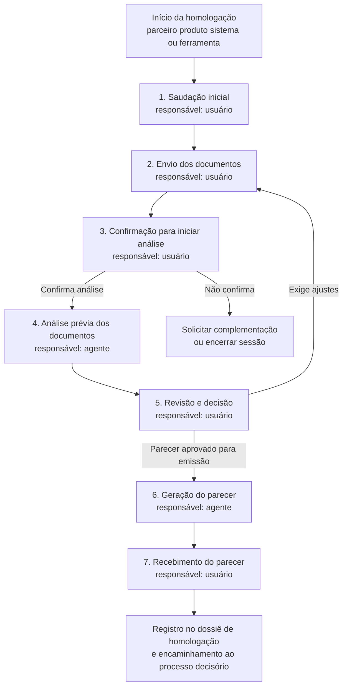
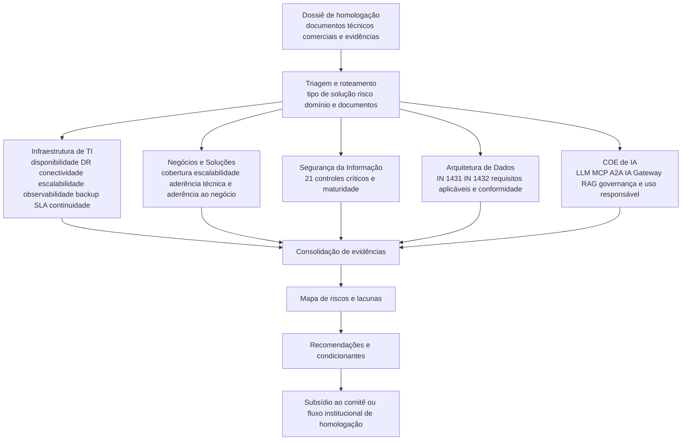
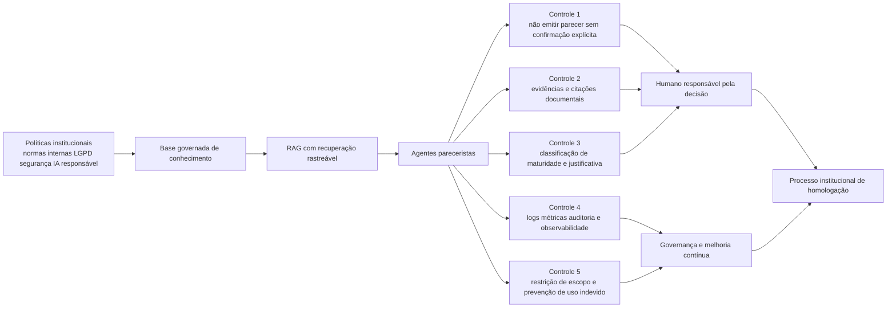
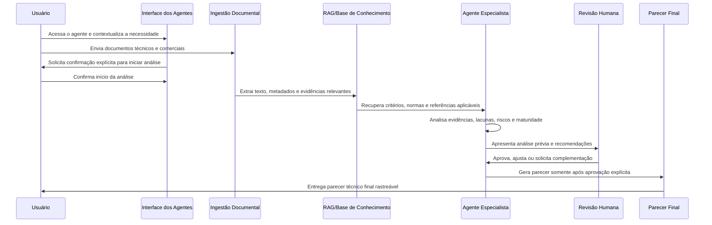
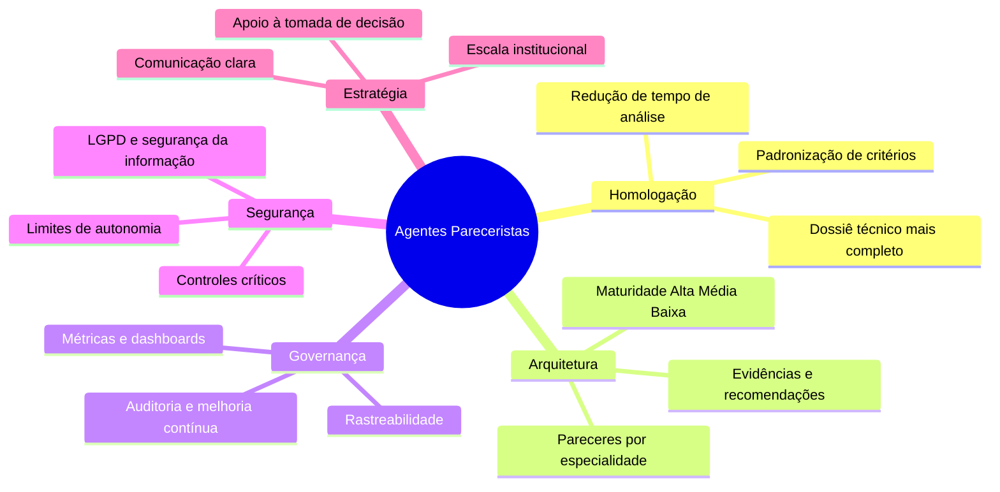

# Agentes Pareceristas de Arquitetura para Homologação de Parceiros, Produtos, Sistemas e Ferramentas

**Autor:** Everton R Martins  
**Versão:** 1.0  
**Status:** proposta de página institucional para Confluence  
**Público-alvo:** áreas demandantes, arquitetura corporativa, segurança da informação, arquitetura de dados, centro de excelência de IA, governança, compras, jurídico, riscos, compliance e lideranças envolvidas no ciclo de homologação.

> **Nota de confidencialidade e uso institucional.** Este material foi estruturado para orientar a comunicação, a adoção e a governança dos **Agentes Pareceristas de Arquitetura** em contexto institucional. Informações sensíveis, normas internas, documentos de fornecedores e critérios proprietários devem permanecer restritos aos ambientes autorizados, com controle de acesso, rastreabilidade e observância às políticas internas de segurança, privacidade e proteção de dados.

## 1. Sumário executivo

Os **Agentes Pareceristas de Arquitetura** são uma capacidade institucional de apoio à análise técnica e documental em processos de homologação de parceiros, produtos, sistemas, plataformas, softwares e ferramentas. A proposta central é acelerar a leitura estruturada de documentos técnicos e comerciais, reduzir variações de interpretação entre análises, aumentar a rastreabilidade das evidências avaliadas e produzir pareceres técnicos mais consistentes, sempre com **confirmação humana explícita antes da emissão do parecer final**.

Essa solução foi concebida com cinco especializações complementares: **Infraestrutura de TI**, **Negócios e Soluções**, **Segurança da Informação**, **Arquitetura de Dados** e **Centro de Excelência de IA**. Cada agente atua como um parecerista especializado sobre um recorte do dossiê de homologação, avaliando critérios objetivos, lacunas, riscos, evidências documentais e maturidade da solução. O resultado esperado não é substituir o processo institucional, tampouco eliminar a decisão humana, mas elevar a qualidade e a velocidade do processo ao transformar documentos heterogêneos em análises estruturadas e acionáveis.

A solução se alinha a boas práticas modernas de IA generativa, **RAG — Retrieval-Augmented Generation**, governança de IA, segurança de aplicações LLM e gestão de risco. O NIST propõe que riscos de IA generativa sejam governados, mapeados, medidos e gerenciados como parte de um perfil específico do AI Risk Management Framework, enquanto a ISO/IEC 42001:2023 define requisitos para um sistema de gestão de IA que cubra estabelecimento, implementação, manutenção e melhoria contínua de práticas organizacionais de IA.[1] [2] Em termos de arquitetura, RAG permite combinar modelos generativos com recuperação de conhecimento externo, melhorando grounding, atualização e rastreabilidade das respostas em tarefas intensivas em conhecimento.[6]

| Dimensão | Direcionamento institucional |
|---|---|
| **Dor principal** | Análises documentais longas, heterogêneas, com alto esforço manual, múltiplas áreas envolvidas e dificuldade de consolidar evidências técnicas e comerciais. |
| **Proposta de valor** | Acelerar a análise prévia, padronizar critérios, melhorar rastreabilidade, apoiar decisão e fortalecer governança do processo de homologação. |
| **Princípio operacional** | O agente analisa, classifica, justifica e recomenda; o humano revisa, decide e autoriza a geração do parecer final. |
| **Escopo técnico** | Documentos PDF, DOCX, TXT, XLSX, PNG e JPG, com foco em propostas técnicas, comerciais, evidências de arquitetura, segurança, dados, IA e aderência ao negócio. |
| **Limite fundamental** | Os agentes **não são o processo de homologação**. Eles são uma camada de apoio especializada dentro de um processo institucional que deve permanecer governado, auditável e revisado periodicamente. |

## 2. A dor que os agentes resolvem

Processos de homologação costumam reunir um volume expressivo de documentos técnicos, comerciais e evidenciais. Em contextos bancários e regulados, esse volume tende a ser ainda mais crítico, pois cada fornecedor, produto ou ferramenta pode envolver requisitos de disponibilidade, recuperação de desastres, segurança, privacidade, tratamento de dados, aderência arquitetural, continuidade operacional, integração com ecossistemas existentes e conformidade com políticas internas. Quando a análise depende exclusivamente de leitura manual e interpretação distribuída entre especialistas, surgem gargalos previsíveis: demora de ciclo, inconsistência de critérios, dificuldade de rastrear evidências e risco de pareceres incompletos.

A introdução de agentes pareceristas cria um mecanismo de **triagem técnica especializada**. Os agentes podem ler documentos, extrair informações relevantes, confrontar evidências com critérios e normas, apontar lacunas e estruturar um parecer inicial. Essa abordagem é consistente com a evolução de sistemas baseados em LLMs para workflows mais complexos, nos quais agentes usam planejamento, ferramentas, memória, recuperação de conhecimento e reflexão para realizar tarefas multietapas.[7] Entretanto, a literatura também alerta que agentes baseados em LLM precisam ser avaliados quanto a segurança, robustez, custo-eficiência e confiabilidade, especialmente quando empregados em atividades organizacionais críticas.[8]

| Sintoma observado no processo tradicional | Consequência para a instituição | Como os agentes ajudam |
|---|---|---|
| Documentos extensos e heterogêneos | Aumento do tempo de análise e risco de perda de evidências | Extração, organização e sumarização estruturada dos documentos enviados. |
| Critérios distribuídos entre áreas | Pareceres com granularidade variável e dificuldade de comparação | Padronização de perguntas, critérios e classificação de maturidade por especialidade. |
| Dependência de especialistas escassos | Gargalos em arquitetura, segurança, dados e IA | Pré-análise automatizada para que especialistas foquem em decisão, exceções e riscos críticos. |
| Ausência de trilha consolidada | Dificuldade de auditoria, justificativa e reaproveitamento de conhecimento | Registro de evidências, recomendações, lacunas e histórico conversacional. |
| Pressão por velocidade | Risco de homologar sem análise suficiente ou atrasar iniciativas de negócio | Aceleração com controle humano, preservando governança e responsabilidade. |

## 3. O que são os Agentes Pareceristas de Arquitetura

Os Agentes Pareceristas são componentes de uma solução conversacional de IA voltada a **análise assistida de dossiês de homologação**. Eles não são chatbots genéricos. Cada agente possui um domínio de especialização, um conjunto de critérios avaliativos e uma responsabilidade clara na produção de análise técnica. O valor da solução surge da combinação entre especialização, recuperação de conhecimento institucional, controle humano e padronização de saída.

Em arquiteturas modernas de IA agentic, componentes como frontend, framework de agentes, ferramentas, memória, runtime, modelo e runtime de modelo precisam ser escolhidos de forma deliberada para atender ao domínio e ao nível de criticidade da aplicação.[10] Em ambientes de produção, plataformas de construção e governança de agentes, como as oferecidas em nuvens corporativas, reforçam a necessidade de escalar e governar agentes com segurança, observabilidade e integração aos sistemas existentes.[11]

| Agente parecerista | Papel principal | Critérios avaliativos centrais | Saída esperada |
|---|---|---|---|
| **Agente de Arquitetura de Infraestrutura de TI** | Avaliar a robustez operacional e a sustentação tecnológica da solução. | Alta disponibilidade, plano de recuperação de desastres, conectividade segura, escalabilidade, autorrecuperação, monitoramento, observabilidade, segurança, armazenamento, backup, SLA e continuidade. | Parecer sobre capacidade operacional, riscos de infraestrutura, lacunas de continuidade e maturidade técnica. |
| **Agente de Arquitetura de Negócios e Soluções** | Avaliar aderência entre necessidade de negócio, solução proposta e viabilidade arquitetural. | Cobertura funcional, escalabilidade, aderência técnica e aderência ao negócio. | Parecer sobre adequação da solução ao objetivo institucional, limites de cobertura e condicionantes de adoção. |
| **Agente de Arquitetura de Segurança da Informação** | Avaliar controles críticos e maturidade de segurança da solução. | 21 controles críticos, classificação de maturidade Alta, Média ou Baixa, riscos e evidências de segurança. | Parecer sobre maturidade de segurança, riscos residuais, controles faltantes e recomendações de mitigação. |
| **Agente de Arquitetura de Dados** | Avaliar conformidade e adequação sob a ótica de arquitetura de dados. | Requisitos aplicáveis, conformidade com IN 1431 e IN 1432, tratamento, integração, armazenamento e governança de dados. | Parecer sobre aderência a requisitos de dados, lacunas de conformidade e recomendações arquiteturais. |
| **Agente de Arquitetura do Centro de Excelência de IA** | Avaliar soluções que envolvem IA, LLMs, MCPs, A2A, IA Gateway e práticas de IA responsável. | Uso de LLM, RAG, MCP, A2A, governança, explicabilidade, segurança, métricas, memória, integração e operação responsável. | Parecer sobre viabilidade, riscos, arquitetura de IA, limites de autonomia, governança e requisitos de observabilidade. |

## 4. Por que os agentes importam estrategicamente

A relevância estratégica dos agentes decorre de três movimentos simultâneos. O primeiro é a pressão por **agilidade institucional**: áreas de negócio demandam homologações mais rápidas para capturar oportunidades, integrar fornecedores e lançar soluções. O segundo é a pressão por **segurança e conformidade**: instituições reguladas precisam demonstrar diligência, rastreabilidade e adequação a normas de segurança, privacidade e governança. O terceiro é a evolução técnica dos sistemas de IA, que permite combinar LLMs, RAG, ferramentas, memória e workflows humanos para produzir análises mais contextualizadas.[6] [7]

RAG é especialmente importante porque reduz a dependência exclusiva do conhecimento paramétrico do modelo. O artigo seminal de Lewis et al. descreve RAG como uma abordagem que combina memória paramétrica e memória não paramétrica recuperável para tarefas intensivas em conhecimento.[6] Em termos práticos, isso significa que os agentes pareceristas devem consultar critérios, normas, checklists e conhecimento institucional governado, evitando que respostas sejam baseadas apenas em conhecimento genérico do modelo. Essa abordagem também facilita a indicação de evidências e a sustentação do parecer por documentos recuperados.

| Pilar estratégico | Implicação prática | Resultado esperado |
|---|---|---|
| **Eficiência operacional** | Automatizar leitura preliminar, classificação e estruturação de evidências. | Redução de tempo de ciclo e melhor uso da capacidade dos especialistas. |
| **Padronização técnica** | Aplicar critérios recorrentes por domínio de arquitetura. | Comparabilidade entre homologações e menor variabilidade de pareceres. |
| **Governança e auditoria** | Registrar evidências, decisões, confirmações e trilhas de análise. | Maior transparência e sustentação em auditorias, revisões e comitês. |
| **IA responsável** | Manter humano no controle, limitar autonomia e monitorar riscos. | Redução de overreliance, erros não detectados e uso indevido. |
| **Escala institucional** | Criar uma plataforma reaproveitável para múltiplas áreas e tipos de solução. | Ampliação gradual de cobertura sem perder governança. |

## 5. O que os agentes fazem e o que não fazem

Os agentes fazem uma **análise assistida** dos documentos enviados pelo usuário. Eles extraem informações, avaliam critérios, classificam maturidade, identificam lacunas, sugerem perguntas complementares, consolidam evidências e geram um parecer técnico final somente quando o usuário confirma explicitamente a emissão. Esse desenho é importante porque preserva o princípio de responsabilidade humana na decisão, especialmente em aplicações de apoio à decisão. Estudos sobre interação humano-IA em decisões públicas e organizacionais mostram que usuários podem apresentar vieses de automação ou adesão seletiva ao algoritmo, motivo pelo qual o desenho do processo deve reforçar revisão crítica, transparência e responsabilização humana.[9]

Os agentes não devem ser tratados como autoridade final, mecanismo de aprovação automática, substituto de comitê, substituto de jurídico, substituto de auditoria, ferramenta para burlar controles ou canal informal para avaliar documentos fora do processo. Eles também não devem ser usados para inserir dados pessoais ou sensíveis sem fundamento legal, controle de acesso e aderência às políticas de proteção de dados. A LGPD define tratamento de dados pessoais como um conjunto amplo de operações, incluindo coleta, recepção, utilização, acesso, armazenamento, comunicação e eliminação, e estabelece como fundamentos a privacidade e a autodeterminação informativa.[4]

| Os agentes **são** | Os agentes **não são** |
|---|---|
| Uma camada especializada de análise documental assistida por IA. | Um substituto integral do processo institucional de homologação. |
| Uma forma de acelerar pré-análises e organizar evidências. | Uma aprovação automática de fornecedores, produtos ou ferramentas. |
| Um apoio a especialistas, com critérios e trilha de auditoria. | Uma dispensa de análise humana, compliance, jurídico, segurança ou governança. |
| Um mecanismo de padronização de pareceres técnicos. | Uma fonte infalível de verdade ou decisão final sem contestação. |
| Uma solução que deve operar com confirmação explícita para gerar parecer. | Um canal para executar análise sem documentação, sem autorização ou fora do escopo. |

## 6. Processo recomendado de uso: do início ao parecer final

O processo recomendado possui sete passos. A experiência deve ser simples para o usuário, mas rigorosa do ponto de vista de governança. O fluxo começa com a saudação inicial e contextualização da demanda, passa pelo envio de documentos, exige confirmação explícita para iniciar a análise, realiza a análise prévia, apresenta os achados para revisão humana, gera o parecer somente após autorização e finaliza com o recebimento do parecer. Esse desenho cria uma separação saudável entre **análise automatizada** e **decisão humana**.

| Etapa | Responsável primário | Objetivo | Controle mínimo recomendado | Saída esperada |
|---|---|---|---|---|
| 1. Saudação inicial | Usuário | Informar intenção, tipo de homologação e contexto da análise. | Identificar área, finalidade, tipo de solução e agente adequado. | Contexto inicial da demanda. |
| 2. Envio de documentos | Usuário | Fornecer proposta técnica, comercial, evidências e anexos. | Validar formatos aceitos e restrições de confidencialidade. | Dossiê documental carregado. |
| 3. Confirmação para iniciar análise | Usuário | Autorizar o processamento dos documentos enviados. | Registrar confirmação explícita. | Autorização para análise. |
| 4. Análise prévia dos documentos | Agente | Extrair evidências, aplicar critérios e identificar lacunas. | Usar conhecimento governado, registrar evidências e limitar escopo. | Relatório preliminar de análise. |
| 5. Revisão e decisão | Usuário | Avaliar achados, complementar informações e decidir se o parecer deve ser emitido. | Exigir validação humana e permitir ajustes. | Decisão de gerar, revisar ou complementar. |
| 6. Geração do parecer | Agente | Produzir parecer final estruturado. | Gerar somente após autorização explícita. | Parecer técnico final. |
| 7. Recebimento do parecer | Usuário | Receber, encaminhar e registrar o parecer no processo institucional. | Registrar versão, data, agente, insumos e responsável. | Parecer anexado ao dossiê de homologação. |

## 7. Matriz RACI dos sete passos

A matriz abaixo foi estruturada no padrão **RACI**, equivalente ao objetivo solicitado como matriz de responsabilidades. Neste contexto, **R** representa quem executa a atividade, **A** quem responde pela decisão ou aceite final, **C** quem deve ser consultado e **I** quem deve ser informado. Quando a organização preferir o termo **RACE**, recomenda-se documentar formalmente o significado de cada letra para evitar ambiguidade operacional.

| Etapa | Usuário solicitante | Agente parecerista | Especialista de arquitetura | Segurança/risco/compliance | Gestor ou comitê de homologação | Observação de governança |
|---|---|---|---|---|---|---|
| 1. Saudação inicial | **R/A** | I | I | I | I | O usuário inicia a jornada e informa o objetivo da homologação. |
| 2. Envio de documentos | **R/A** | I | C | C | I | O usuário é responsável por enviar documentos corretos, completos e autorizados. |
| 3. Confirmação para iniciar análise | **R/A** | I | I | C | I | A análise automatizada só deve começar após confirmação explícita. |
| 4. Análise prévia dos documentos | C | **R** | C | C | I | O agente executa análise inicial, mas especialistas podem ser consultados para critérios críticos. |
| 5. Revisão e decisão | **R/A** | C | C | C | I | O humano revisa achados e decide se o parecer pode ser gerado. |
| 6. Geração do parecer | C | **R** | C | C | I | O agente emite parecer apenas após decisão humana. |
| 7. Recebimento do parecer | **R** | I | I | I | **A/I** | O parecer deve ser anexado ao dossiê e encaminhado conforme rito institucional. |

## 8. Arquitetura conceitual da solução

A arquitetura conceitual parte de uma interface web autenticada, passa por um orquestrador conversacional, uma camada de ingestão documental, uma base de conhecimento com RAG, agentes especialistas, motor de evidências e maturidade, revisão humana, geração de parecer e trilha de auditoria. Essa arquitetura é intencionalmente modular para permitir evolução por agente, por critério, por integração e por política de governança.

```mermaid
flowchart LR
    U[Usuário solicitante<br/>área demandante ou homologação] --> UI[Interface web<br/>Agentes Solucionadores de Arquitetura]
    UI --> AUTH[Autenticação e perfil de acesso]
    AUTH --> ORQ[Orquestrador conversacional<br/>controle de sessão e confirmação humana]

    ORQ --> DOC[Serviço de ingestão documental<br/>PDF DOCX TXT XLSX PNG JPG]
    DOC --> OCR[Extração textual/OCR<br/>normalização e metadados]
    OCR --> CLASS[Classificação documental<br/>técnico comercial evidências anexos]

    CLASS --> RAG[Camada RAG e base de conhecimento<br/>políticas critérios normas checklists]
    RAG --> A1[Agente Infraestrutura de TI]
    RAG --> A2[Agente Negócios e Soluções]
    RAG --> A3[Agente Segurança da Informação]
    RAG --> A4[Agente Arquitetura de Dados]
    RAG --> A5[Agente COE de IA]

    A1 --> SCORE[Motor de evidências e maturidade<br/>Alta Média Baixa]
    A2 --> SCORE
    A3 --> SCORE
    A4 --> SCORE
    A5 --> SCORE

    SCORE --> REVIEW[Revisão humana obrigatória<br/>decisão de gerar parecer]
    REVIEW -->|Confirmação explícita| PARECER[Geração do parecer técnico final]
    REVIEW -->|Sem confirmação| WAIT[Aguardando ajustes ou novos documentos]

    PARECER --> AUDIT[Histórico, trilha de auditoria<br/>métricas e observabilidade]
    AUDIT --> DASH[Dashboard de adoção, qualidade<br/>SLA e melhoria contínua]
```

| Camada | Responsabilidade | Controles recomendados |
|---|---|---|
| Interface web | Oferecer acesso simples, menu de agentes e experiência guiada. | Autenticação, perfis de acesso, mensagens de escopo e termos de uso. |
| Orquestração conversacional | Controlar sessão, confirmação humana, histórico e roteamento. | Trilha de auditoria, controle de etapas e bloqueio de emissão sem aprovação. |
| Ingestão documental | Receber documentos, extrair texto, metadados e evidências. | Antivírus, validação de formato, classificação de informação e retenção controlada. |
| RAG/Base de conhecimento | Recuperar normas, critérios, checklists e conhecimento institucional. | Curadoria, versionamento, controle de fontes e atualização periódica. |
| Agentes especialistas | Aplicar critérios por domínio e produzir análise estruturada. | Guardrails, templates de parecer, critérios objetivos e teste de regressão. |
| Revisão humana | Revisar achados e autorizar parecer final. | Confirmação explícita, segregação de responsabilidades e registro de decisão. |
| Observabilidade | Medir adoção, qualidade, tempo, erro, custo e risco. | Dashboards, alertas, logs, métricas por agente e melhoria contínua. |

## 9. Integração funcional entre os cinco agentes

Os cinco agentes devem operar como pareceristas especializados e complementares. Nem toda homologação exigirá todos os agentes na mesma profundidade, mas o sistema deve permitir roteamento conforme tipo de solução, risco, presença de dados, uso de IA, criticidade operacional e exigências regulatórias. Soluções com IA, por exemplo, devem acionar o agente do COE de IA; soluções com dados sensíveis devem acionar arquitetura de dados, segurança e privacidade; soluções críticas de operação devem acionar infraestrutura de TI.

| Tipo de homologação | Agentes recomendados | Justificativa |
|---|---|---|
| Ferramenta SaaS sem IA e com dados não sensíveis | Negócios e Soluções, Segurança da Informação, Infraestrutura de TI | Avaliar aderência, segurança, disponibilidade e integração operacional. |
| Plataforma com tratamento de dados pessoais | Dados, Segurança da Informação, Negócios e Soluções | Avaliar requisitos de dados, privacidade, segurança e aderência ao objetivo. |
| Solução crítica para operação bancária | Infraestrutura de TI, Segurança da Informação, Dados, Negócios e Soluções | Avaliar continuidade, DR, SLA, segurança, dados e impacto ao negócio. |
| Produto com LLM, RAG, agentes ou automação autônoma | COE de IA, Segurança da Informação, Dados, Negócios e Soluções | Avaliar IA responsável, riscos de LLM, dados, segurança, explicabilidade e governança. |
| Integração com APIs, MCPs, A2A ou ferramentas externas | COE de IA, Segurança da Informação, Infraestrutura de TI | Avaliar limites de agência, exposição de APIs, autenticação, logs e continuidade. |

## 10. Governança, segurança e limites de autonomia

A governança dos agentes deve ser explícita. Aplicações LLM trazem riscos específicos, incluindo prompt injection, vazamento de informações sensíveis, manipulação de saída, agência excessiva e confiança indevida nos resultados.[3] Por isso, os agentes pareceristas devem operar com guardrails técnicos e processuais. A emissão do parecer final precisa ser bloqueada até que o usuário revise a análise preliminar e confirme explicitamente a geração.

| Risco | Descrição | Controle recomendado |
|---|---|---|
| Prompt injection | Documentos ou entradas podem tentar manipular o comportamento do agente. | Separar instruções de sistema, conteúdo documental e comandos do usuário; sanitizar entradas; aplicar políticas fixas de ferramenta. |
| Vazamento de informação sensível | O agente pode expor dados pessoais, comerciais ou estratégicos indevidamente. | Controle de acesso, mascaramento, classificação de dados, logs seguros e aderência à LGPD. |
| Overreliance | Usuários podem confiar demais no parecer preliminar. | Mensagens de escopo, revisão humana obrigatória e registro de responsabilidade. |
| Agência excessiva | Agentes poderiam agir além do permitido, como aprovar automaticamente. | Limitar ações, bloquear emissão sem confirmação e não permitir decisões finais autônomas. |
| Alucinação ou erro factual | O agente pode gerar inferências sem suporte documental. | RAG governado, exigência de evidências, templates com campos obrigatórios e validação de lacunas. |
| Critérios desatualizados | Normas internas e políticas podem mudar. | Versionamento da base de conhecimento, revisão periódica e dono por domínio. |

## 11. Fluxo RAG, memória e parecer rastreável

O uso de RAG deve ser interpretado como uma camada de grounding e rastreabilidade. O agente não deve apenas responder de forma fluente; ele deve explicar quais documentos, critérios e evidências sustentam sua análise. Em cenários de homologação, a qualidade do parecer depende da capacidade de indicar lacunas, distinguir ausência de evidência de não conformidade e separar fatos documentados de inferências.

| Elemento | Função recomendada | Observação de qualidade |
|---|---|---|
| Memória curta | Manter contexto da sessão, documentos enviados, perguntas e respostas recentes. | Deve expirar conforme política de sessão e classificação da informação. |
| Memória longa | Preservar conhecimento institucional aprovado, critérios, modelos e histórico autorizado. | Deve ter dono, versionamento e curadoria. |
| Memória episódica | Registrar interações relevantes do caso, confirmações e decisões. | Útil para auditoria e reprodutibilidade do parecer. |
| RAG | Recuperar trechos normativos, checklists e evidências documentais. | Deve priorizar fontes confiáveis, atualizadas e rastreáveis. |
| Template de parecer | Garantir estrutura de saída padronizada. | Deve incluir escopo, documentos analisados, evidências, lacunas, riscos e recomendação. |

## 12. Momento ideal de uso no processo de homologação

Os agentes devem ser usados **após a formação mínima do dossiê documental** e **antes da deliberação formal de homologação**. Esse posicionamento maximiza o valor da análise porque o agente recebe material suficiente para avaliar e ainda há tempo para solicitar complementações, corrigir lacunas, envolver especialistas e condicionar a aprovação.

| Momento do ciclo | Deve usar os agentes? | Razão |
|---|---|---|
| Ideação inicial sem fornecedor definido | Parcialmente | Pode apoiar checklists e perguntas orientativas, mas não deve emitir parecer por falta de evidências. |
| RFI/RFP ou avaliação preliminar | Sim, de forma exploratória | Ajuda a comparar propostas e levantar riscos iniciais. |
| Dossiê de homologação recebido | **Sim, uso recomendado** | É o momento ideal para análise estruturada dos documentos. |
| Antes do comitê de decisão | **Sim, uso recomendado** | Produz subsídio técnico, lacunas e condicionantes para decisão. |
| Após contratação | Sim, para revisão de aderência | Pode apoiar auditoria, revisão pós-implantação e melhoria contínua. |
| Sem documentos ou evidências | Não para parecer final | O agente deve solicitar complementação e registrar insuficiência documental. |

## 13. Modelo de parecer técnico recomendado

Para garantir consistência institucional, cada parecer final deve seguir uma estrutura mínima. O objetivo não é gerar um texto longo sem governança, mas um documento técnico, objetivo, rastreável e comparável entre homologações.

| Seção do parecer | Conteúdo esperado |
|---|---|
| Identificação | Nome da solução, fornecedor, data, área solicitante, agente utilizado e versão do template. |
| Escopo da análise | O que foi analisado e o que ficou fora do escopo. |
| Documentos avaliados | Lista dos documentos, versões, datas e tipos de arquivo. |
| Critérios aplicados | Critérios por domínio de arquitetura, normas internas e checklists utilizados. |
| Evidências encontradas | Evidências documentais que sustentam o parecer. |
| Lacunas e pendências | Informações ausentes, inconsistentes ou insuficientes. |
| Maturidade | Classificação Alta, Média ou Baixa, com justificativa. |
| Riscos | Riscos técnicos, operacionais, de segurança, dados, IA ou negócio. |
| Recomendações | Condicionantes, ações mitigadoras e perguntas ao fornecedor. |
| Conclusão | Parecer final, restrições e próximos passos. |
| Registro de aprovação | Confirmação humana, responsável, data e versão. |

## 14. Métricas e dashboards para gestão da solução

A adoção institucional deve ser acompanhada por métricas. Sem métricas, a organização não consegue demonstrar ganho de eficiência, qualidade do parecer, incidência de lacunas, volume por agente, tempo de ciclo, taxa de complementação documental e riscos recorrentes. A avaliação de agentes LLM também deve considerar dimensões como capacidade de planejamento, uso de ferramentas, memória, robustez, segurança e custo-eficiência.[8]

| Categoria | Métrica | Interpretação |
|---|---|---|
| Adoção | Número de análises por agente e por área | Mede penetração institucional e prioriza capacitação. |
| Eficiência | Tempo médio entre envio de documentos e análise preliminar | Mede aceleração do processo. |
| Qualidade | Percentual de pareceres com evidências completas | Mede maturidade do uso e qualidade documental. |
| Governança | Percentual de pareceres emitidos com confirmação explícita registrada | Mede aderência ao controle obrigatório. |
| Risco | Principais lacunas por domínio | Identifica padrões de falha em fornecedores e documentos. |
| Dados e privacidade | Casos com dados pessoais, dados sensíveis ou necessidade de DPIA/RIPD | Apoia compliance com proteção de dados. |
| Segurança | Controles críticos ausentes ou insuficientes | Apoia priorização de mitigação. |
| IA responsável | Casos com LLM, RAG, agentes, MCP, A2A ou IA Gateway | Apoia governança do COE de IA. |

## 15. Estratégia de comunicação e adoção

A página no Confluence deve funcionar como um **ponto de entrada institucional** para que áreas usuárias entendam o que são os agentes, quando utilizá-los, como preparar documentos, qual agente escolher, quais cuidados observar e como interpretar o parecer. A narrativa precisa combinar clareza executiva, profundidade técnica e orientação prática.

| Público | Mensagem-chave | Chamada para ação |
|---|---|---|
| Áreas demandantes | Os agentes reduzem o esforço de leitura inicial e ajudam a preparar um dossiê mais completo. | Envie documentos completos e revise a análise antes de solicitar o parecer. |
| Arquitetos | Os agentes padronizam critérios e liberam tempo para decisões de maior criticidade. | Use os pareceres como subsídio técnico e refine critérios recorrentes. |
| Segurança e riscos | A solução fortalece evidências, controles e rastreabilidade. | Defina checklists críticos e acompanhe lacunas recorrentes. |
| Dados e privacidade | A análise ajuda a identificar requisitos de dados e necessidades de conformidade. | Mantenha normas e instruções atualizadas na base governada. |
| COE de IA | O agente especializado ajuda a governar LLMs, RAG, MCPs, A2A e IA Gateway. | Defina padrões de IA responsável, métricas e limites de autonomia. |
| Liderança | A solução acelera homologação sem abrir mão de governança. | Patrocine adoção, métricas e revisão contínua do processo. |

## 16. Orientação para inclusão de imagens, links e acesso ao produto

A página de Confluence deve reservar uma seção visual para facilitar o acesso ao produto e reduzir barreiras de adoção. Recomenda-se incluir capturas de tela da tela de login, tela inicial, menu lateral com agentes e cards de áreas de atuação. As imagens devem ser tratadas como material interno e publicadas apenas nos espaços autorizados.

| Elemento a incluir | Local recomendado na página | Observação |
|---|---|---|
| Imagem da tela de login | Após o sumário executivo | Ajuda o usuário a reconhecer o produto. |
| Imagem da tela inicial com cards dos agentes | Seção “O que são os agentes” | Mostra as áreas de atuação disponíveis. |
| Imagem do menu lateral autenticado | Seção “Como acessar e escolher um agente” | Facilita navegação e treinamento. |
| Link de acesso ao produto | Box destacado no topo e na seção de acesso | Substituir pelo link oficial interno. |
| Link para política de uso | Seção de governança | Conectar com segurança, privacidade e IA responsável. |
| Link para FAQ ou canal de suporte | Final da página | Reduz dúvidas recorrentes e melhora adoção. |

> **Placeholder para Confluence:** inserir aqui o link oficial do produto: `[Acessar Agentes Pareceristas](https://inserir-link-interno-do-produto)`.

## 17. Recomendações de evolução

A solução deve evoluir por ciclos. O primeiro ciclo deve consolidar experiência de uso, templates de parecer, critérios por agente e trilha de auditoria. O segundo ciclo deve fortalecer integração com bases institucionais, dashboards, versionamento de critérios e mecanismos de avaliação de qualidade. O terceiro ciclo pode avançar para roteamento inteligente, integração com sistemas de homologação e avaliação comparativa entre fornecedores, sempre mantendo limites de autonomia e revisão humana.

| Horizonte | Evolução sugerida | Resultado esperado |
|---|---|---|
| Curto prazo | Formalizar templates, critérios, mensagens de escopo, RACI e controle de confirmação explícita. | Operação segura e comunicável. |
| Médio prazo | Integrar base de conhecimento governada, dashboards e versionamento de normas. | Rastreabilidade e melhoria contínua. |
| Longo prazo | Integrar ao workflow institucional de homologação, com APIs, eventos, métricas e governança de IA. | Escala operacional e gestão por evidências. |

## 18. Requisitos mínimos de segurança, privacidade e conformidade

Como a solução processa documentos potencialmente sensíveis de fornecedores, produtos e sistemas, deve-se adotar controles de segurança e privacidade desde a concepção. A LGPD se aplica ao tratamento de dados pessoais em meios digitais e físicos, e define dado pessoal como informação relacionada a pessoa natural identificada ou identificável.[4] O uso dos agentes deve, portanto, respeitar finalidade, necessidade, segurança, prevenção e responsabilização, além das políticas internas da instituição.

| Controle | Requisito recomendado |
|---|---|
| Controle de acesso | Permitir acesso apenas a usuários autorizados e registrar perfil de uso. |
| Classificação da informação | Identificar documentos confidenciais, dados pessoais, dados sensíveis e informações estratégicas. |
| Retenção e descarte | Definir prazo de retenção para documentos, históricos e pareceres. |
| Registro de tratamento | Registrar operações relevantes de tratamento de dados quando aplicável. |
| Segurança de documentos | Validar formatos, verificar malware, controlar download e restringir compartilhamento. |
| Logs e auditoria | Manter logs de sessão, confirmação explícita, versão do parecer e artefatos analisados. |
| Avaliação de IA | Monitorar qualidade, drift de critérios, incidentes, erros e feedback humano. |
| Revisão periódica | Atualizar critérios, normas e templates conforme mudanças institucionais. |

## 19. Perguntas frequentes sugeridas para a página

| Pergunta | Resposta sugerida |
|---|---|
| Os agentes aprovam automaticamente um fornecedor? | Não. Eles produzem análise e parecer técnico mediante confirmação humana, mas não substituem o processo institucional de homologação. |
| Posso gerar parecer sem anexar documentos? | Não é recomendado. Sem documentos, o agente deve solicitar complementação ou registrar insuficiência de evidências. |
| O parecer do agente é obrigatório? | A obrigatoriedade depende da política institucional. A recomendação é usá-lo como subsídio estruturado para decisões de homologação. |
| Qual agente devo usar? | Escolha conforme o domínio da solução. Soluções de IA devem envolver o COE de IA; soluções com dados devem envolver arquitetura de dados e segurança; soluções críticas devem envolver infraestrutura. |
| O usuário precisa revisar a análise? | Sim. A revisão humana é um controle obrigatório antes da geração do parecer final. |
| Posso enviar documentos com dados pessoais? | Apenas quando houver autorização, finalidade legítima, necessidade e aderência às políticas de privacidade e segurança. |

## 20. Conclusão

Os Agentes Pareceristas de Arquitetura representam uma evolução relevante na forma como a instituição pode conduzir análises de homologação. Eles combinam IA generativa, especialização por domínio, RAG, critérios objetivos e revisão humana para transformar documentos extensos em pareceres técnicos mais estruturados, comparáveis e auditáveis. A adoção bem-sucedida depende de comunicação clara, governança explícita, atualização contínua da base de conhecimento e métricas de qualidade.

A mensagem central para a instituição é simples: os agentes existem para **acelerar com responsabilidade**, **padronizar com rastreabilidade** e **apoiar decisões humanas melhor informadas**. O seu maior valor não está em automatizar a decisão, mas em melhorar o processo de preparação, análise e fundamentação da decisão.

> **Nota de rodapé institucional.** Os agentes estão inseridos em um processo de homologação, mas **não são o processo**. O processo institucional de homologação deverá ser revisto, formalizado e continuamente aprimorado para incorporar corretamente os agentes, suas responsabilidades, seus limites, suas métricas e seus controles de governança.

## 21. Glossário de termos técnicos e acrônimos

| Termo | Definição |
|---|---|
| **A2A** | Agent-to-Agent; padrão ou abordagem de comunicação entre agentes para colaboração e delegação de tarefas. |
| **AI Gateway / IA Gateway** | Camada de controle para acesso a modelos de IA, políticas, autenticação, logs, rate limiting e observabilidade. |
| **AII** | Termo usado no contexto do prompt para segurança e governança de IA; recomenda-se padronizar internamente como “AI/IA Security” ou “IA Responsável”. |
| **COE** | Centro de Excelência; estrutura organizacional responsável por padrões, governança, capacitação e boas práticas. |
| **DPIA/RIPD** | Data Protection Impact Assessment ou Relatório de Impacto à Proteção de Dados Pessoais; documento para identificar riscos de tratamento de dados pessoais. |
| **DR** | Disaster Recovery; plano e capacidades de recuperação após desastre. |
| **Guardrails** | Controles técnicos e processuais que limitam o comportamento de sistemas de IA. |
| **LGPD** | Lei Geral de Proteção de Dados Pessoais, Lei nº 13.709/2018. |
| **LLM** | Large Language Model; modelo de linguagem de grande escala. |
| **MCP** | Model Context Protocol; protocolo para conectar modelos/agentes a ferramentas, dados e sistemas externos. |
| **Observabilidade** | Capacidade de monitorar comportamento, desempenho, logs, métricas e eventos de um sistema. |
| **RACI** | Matriz de responsabilidades: Responsible, Accountable, Consulted e Informed. |
| **RAG** | Retrieval-Augmented Generation; técnica que combina recuperação de informações externas com geração por LLM. |
| **SLA** | Service Level Agreement; acordo de nível de serviço. |
| **Overreliance** | Confiança excessiva em sistemas automatizados, reduzindo revisão crítica humana. |

## 22. Referências

[1]: https://www.nist.gov/publications/artificial-intelligence-risk-management-framework-generative-artificial-intelligence "NIST AI 600-1 — Artificial Intelligence Risk Management Framework: Generative Artificial Intelligence Profile"

[2]: https://www.iso.org/standard/42001 "ISO/IEC 42001:2023 — Artificial intelligence management system"

[3]: https://owasp.org/www-project-top-10-for-large-language-model-applications/ "OWASP Top 10 for Large Language Model Applications"

[4]: https://www.planalto.gov.br/ccivil_03/_ato2015-2018/2018/lei/l13709.htm "Lei nº 13.709/2018 — Lei Geral de Proteção de Dados Pessoais"

[5]: https://www.gov.br/anpd/pt-br/centrais-de-conteudo/materiais-educativos-e-publicacoes/guia-orientativo-sobre-seguranca-da-informacao-para-agentes-de-tratamento-de-pequeno-porte "ANPD — Guia orientativo sobre segurança da informação para agentes de tratamento"

[6]: https://arxiv.org/abs/2005.11401 "Lewis et al. — Retrieval-Augmented Generation for Knowledge-Intensive NLP Tasks"

[7]: https://arxiv.org/abs/2501.09136 "Agentic Retrieval-Augmented Generation: A Survey"

[8]: https://arxiv.org/abs/2503.16416 "A Survey on the Evaluation of Large Language Model based Agents"

[9]: https://academic.oup.com/jpart/article-abstract/33/1/153/6524536 "Alon-Barkat & Busuioc — Human–AI Interactions in Public Sector Decision Making"

[10]: https://docs.cloud.google.com/architecture/choose-agentic-ai-architecture-components "Google Cloud — Choose your agentic AI architecture components"

[11]: https://docs.cloud.google.com/agent-builder "Google Cloud — Vertex AI Agent Builder documentation"

[12]: https://cloud.google.com/use-cases/retrieval-augmented-generation "Google Cloud — Retrieval-Augmented Generation use case"

[13]: https://developers.googleblog.com/en/vertex-ai-rag-engine-a-developers-tool/ "Google Developers Blog — Vertex AI RAG Engine: a developer’s tool"

## 23. Dados do autor e contato

**Autor:** Everton R Martins  
**Email:** engeverton@gmail.com  
**Celular:** +55 11 97690-9313  
**LinkedIn:** https://www.linkedin.com/in/everton-rubens-martins-366b86b4/

![QR Code LinkedIn](https://private-us-east-1.manuscdn.com/sessionFile/8LmmpxR2xqFdDUVJENBuyE/sandbox/JWWUhhxxZW68owX3sE0zzn-images_1780320635280_na1fn_L2hvbWUvdWJ1bnR1L2FnZW50ZXNfcGFyZWNlcmlzdGFzLzA1X2Fzc2V0cy9xcmNvZGVfbGlua2VkaW5fZXZlcnRvbg.png?Policy=eyJTdGF0ZW1lbnQiOlt7IlJlc291cmNlIjoiaHR0cHM6Ly9wcml2YXRlLXVzLWVhc3QtMS5tYW51c2Nkbi5jb20vc2Vzc2lvbkZpbGUvOExtbXB4UjJ4cUZkRFVWSkVOQnV5RS9zYW5kYm94L0pXV1VoaHh4Wlc2OG93WDNzRTB6em4taW1hZ2VzXzE3ODAzMjA2MzUyODBfbmExZm5fTDJodmJXVXZkV0oxYm5SMUwyRm5aVzUwWlhOZmNHRnlaV05sY21semRHRnpMekExWDJGemMyVjBjeTl4Y21OdlpHVmZiR2x1YTJWa2FXNWZaWFpsY25SdmJnLnBuZyIsIkNvbmRpdGlvbiI6eyJEYXRlTGVzc1RoYW4iOnsiQVdTOkVwb2NoVGltZSI6MTc5ODc2MTYwMH19fV19&Key-Pair-Id=K2HSFNDJXOU9YS&Signature=tmSiUSQDlDnqW7y~T7s3-95Ix-ZTFysxkdO68-6k8dFG0NuAxwt9ihqBl3cC5XUEtbcEomEKI~JEFwruETXSfBod1G~XrfzXproMOvd6OIT3bej-fRuSXyLvpQsvfk1n7l6of~CqiIyNVTJWdGN~jBMEp2SJ19IN86JXzfmZcEFt4Lbp2wfx-XpSvjCp~Fq3v8vlWN5c34NMbouQ15aw1VQiHtzpZ6JyK-CnbcJjBOA667ZlKfkpkB8HZEzbajzf1xh3aFTH8GiUeDPYlKhBNcMHyc8S6sIojYUQKwK4tuGPC9oXyqEz2jUSnQntMaro04pwElbE1acW2GD~ngfP8g__)

Agradeço pela troca, pela confiança e pela oportunidade de contribuir para a estruturação de uma iniciativa com potencial relevante de elevar a maturidade institucional no uso de agentes de IA aplicados à arquitetura, homologação e governança técnica.
