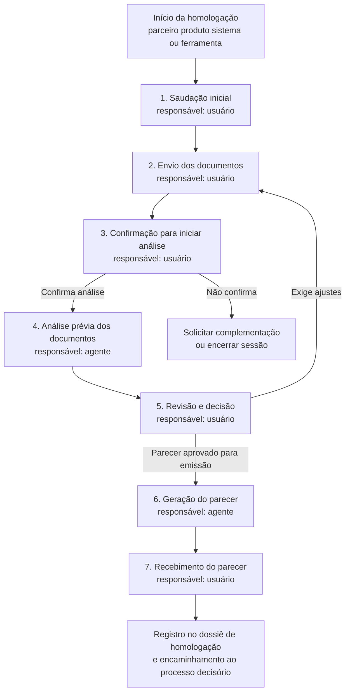
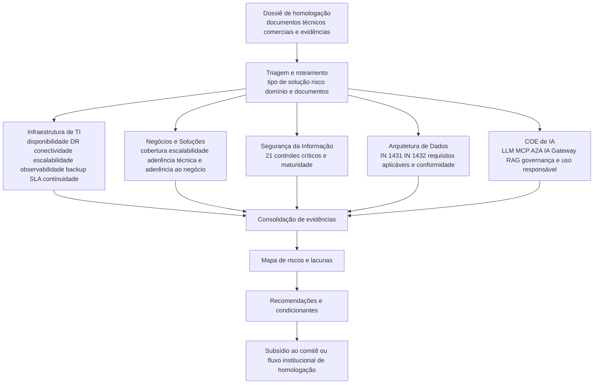
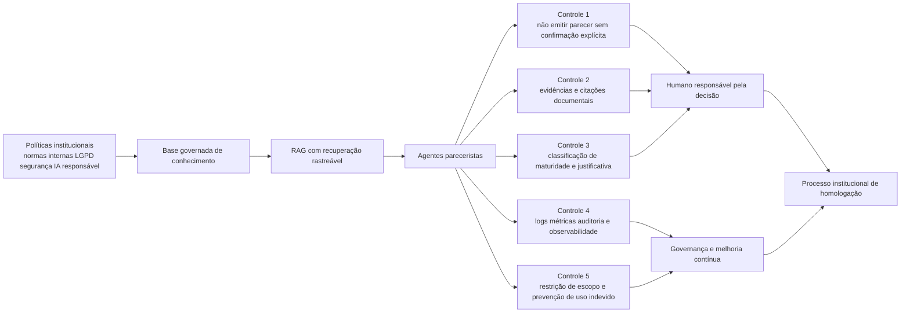
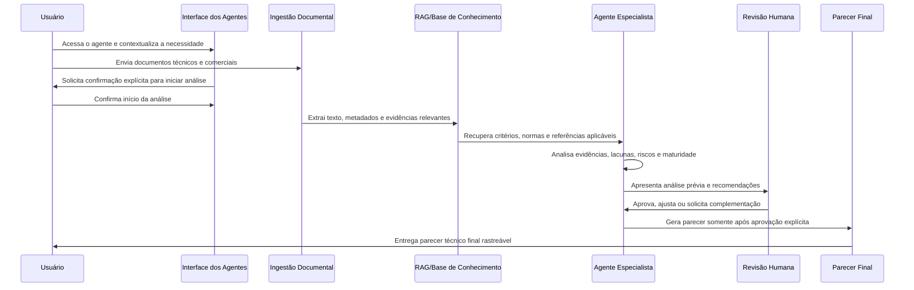
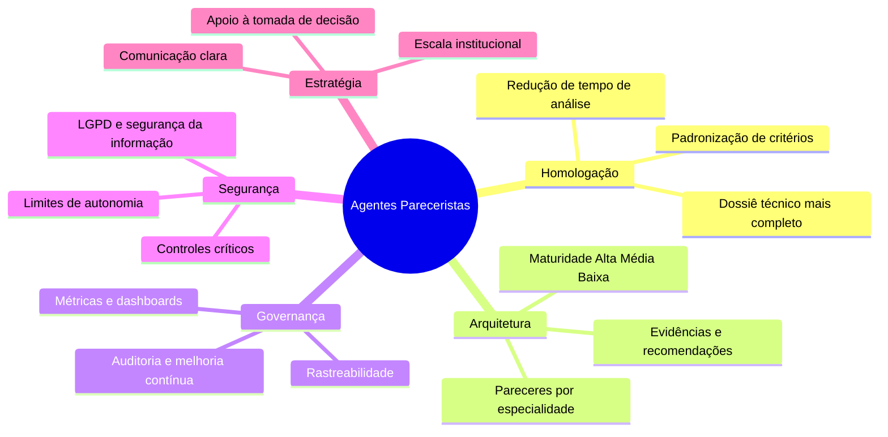

# Diagramas editáveis — Agentes Pareceristas de Arquitetura

Este arquivo contém os diagramas em Mermaid para uso direto no Confluence, em Markdown ou em ferramentas compatíveis com Mermaid. Cada diagrama foi desenhado para ser facilmente editável e também pode ser renderizado como imagem PNG quando necessário.

## Diagrama 1 — Visão de arquitetura da solução

```mermaid
flowchart LR
    U[Usuário solicitante<br/>área demandante ou homologação] --> UI[Interface web<br/>Agentes Solucionadores de Arquitetura]
    UI --> AUTH[Autenticação e perfil de acesso]
    AUTH --> ORQ[Orquestrador conversacional<br/>controle de sessão e confirmação humana]

    ORQ --> DOC[Serviço de ingestão documental<br/>PDF DOCX TXT XLSX PNG JPG]
    DOC --> OCR[Extração textual/OCR<br/>normalização e metadados]
    OCR --> CLASS[Classificação documental<br/>técnico comercial evidências anexos]

    CLASS --> RAG[Camada RAG e base de conhecimento<br/>políticas critérios normas checklists]
    RAG --> A1[Agente Infraestrutura de TI]
    RAG --> A2[Agente Negócios e Soluções]
    RAG --> A3[Agente Segurança da Informação]
    RAG --> A4[Agente Arquitetura de Dados]
    RAG --> A5[Agente COE de IA]

    A1 --> SCORE[Motor de evidências e maturidade<br/>Alta Média Baixa]
    A2 --> SCORE
    A3 --> SCORE
    A4 --> SCORE
    A5 --> SCORE

    SCORE --> REVIEW[Revisão humana obrigatória<br/>decisão de gerar parecer]
    REVIEW -->|Confirmação explícita| PARECER[Geração do parecer técnico final]
    REVIEW -->|Sem confirmação| WAIT[Aguardando ajustes ou novos documentos]

    PARECER --> AUDIT[Histórico, trilha de auditoria<br/>métricas e observabilidade]
    AUDIT --> DASH[Dashboard de adoção, qualidade<br/>SLA e melhoria contínua]
```

## Diagrama 2 — Processo de uso em homologação

## Diagrama 3 — Integração funcional entre os cinco agentes

## Diagrama 4 — Governança, segurança e limites de autonomia

## Diagrama 5 — Fluxo RAG, memória e parecer rastreável

## Diagrama 6 — Mapa de valor para áreas usuárias

